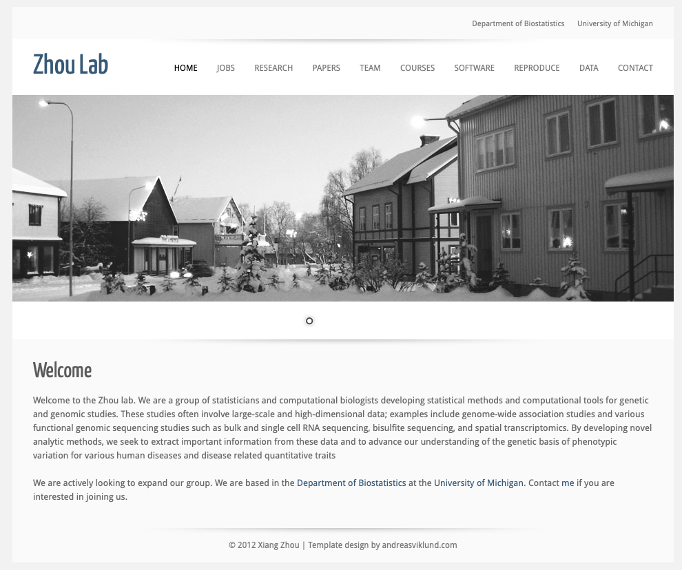

We developed a deconvolution method, 'CARD', that leverages cell type specific expression information from single cell RNA sequencing (scRNA-seq) for the deconvolution of spatial transcriptomics. A unique feature of CARD is its ability to model the spatial correlation in cell type composition across tissue locations, thus enabling spatially informed cell type deconvolution. Modeling spatial correlation allows us to not only borrow the cell type composition information across locations on the entire tissue to accurately infer the cell type composition on each individual location, but also impute cell type compositions and gene expression levels on unmeasured tissue locations, facilitating the construction of a refined spatial tissue map with a resolution much higher than that measured in the original study. We demonstrate the benefits of CARD through extensive simulations and in-depth analysis of four spatial transcriptomics data sets that are paired with different scRNA-seq references. In the real data applications, CARD revealed refined tissue structures with enhanced spatial resolution and identified novel marker genes that underlie the functional and structural organization of the olfactory bulb and hippocampus. CARD also revealed distinct spatial localization of multiple cell types and molecular markers that define the progression, heterogeneity and compartmentalization of pancreatic cancer. 

Cite `CARD`
-------------------
Ying Ma, Xiang Zhou#, Spatially Informed Cell Type Deconvolution for Spatial Transcriptomics, 2021 

Contact
-------------------
if you have questions, feel free to leave messages on the [github issues](https://github.com/YMa-lab/CARD/issues) or contact me through email: yingma@umich.edu

Our group
-------------------
[Zhou lab website](https://www.xzlab.org/)

