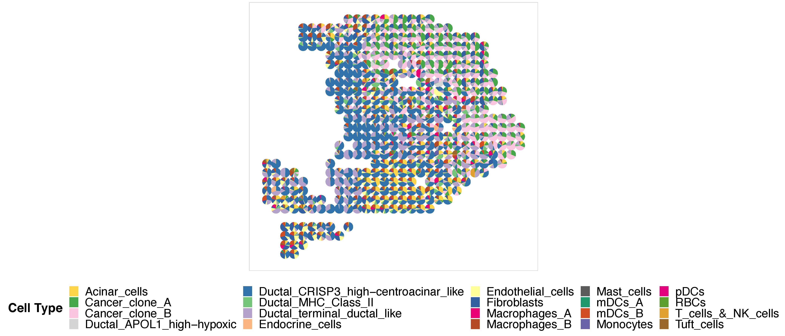
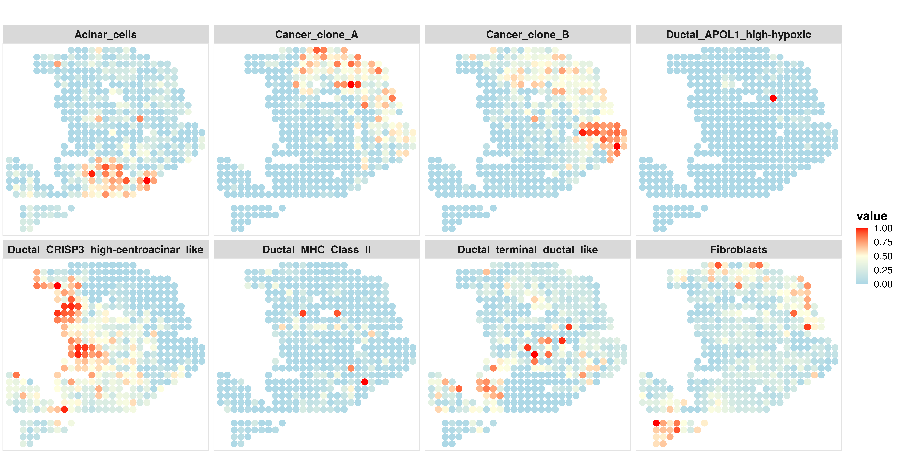
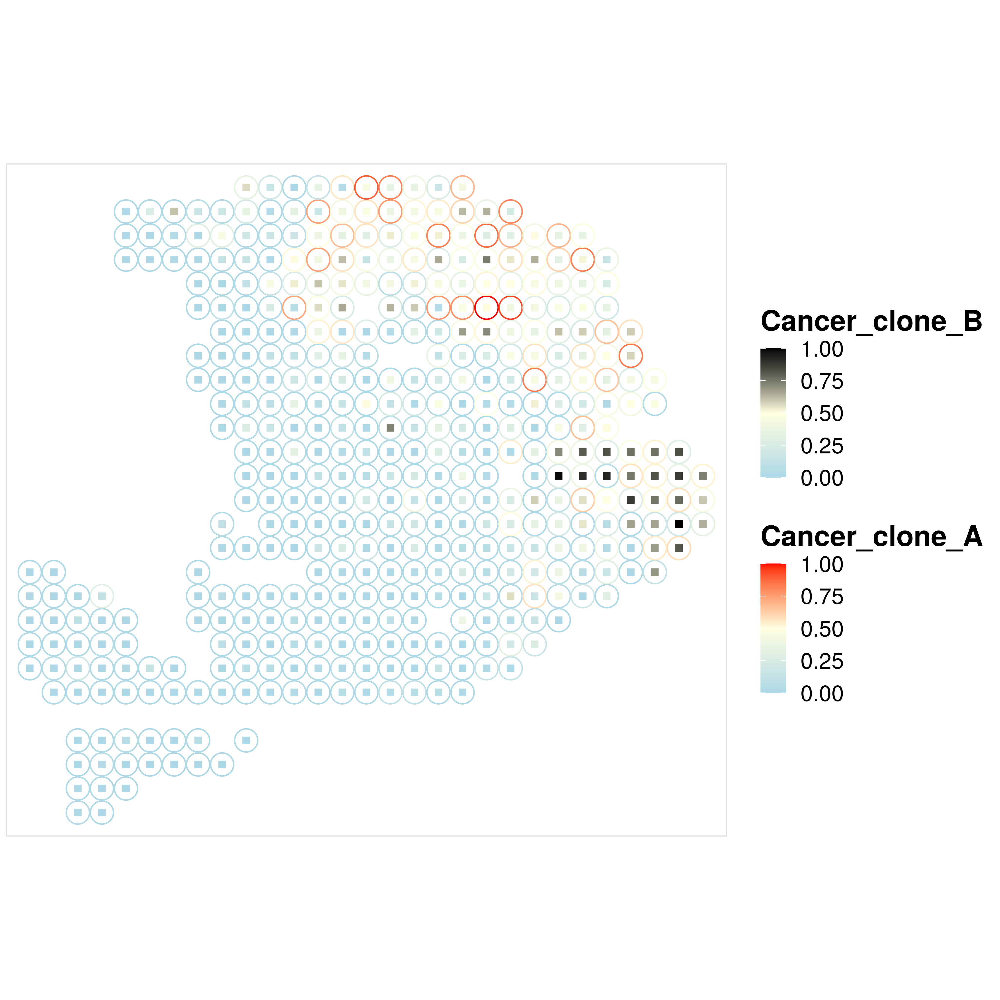
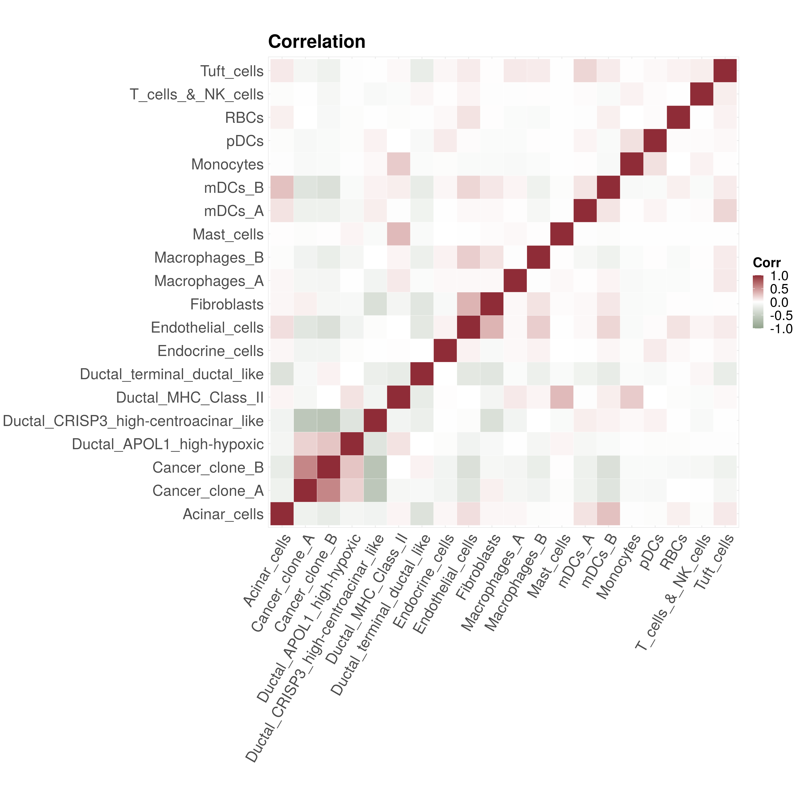
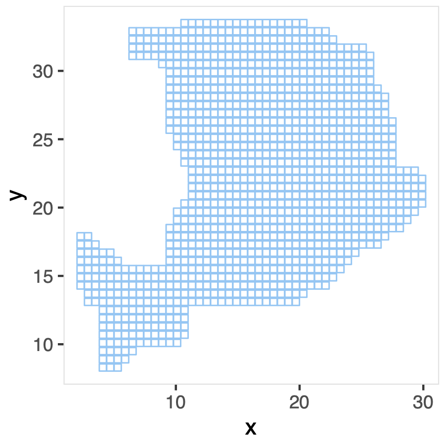
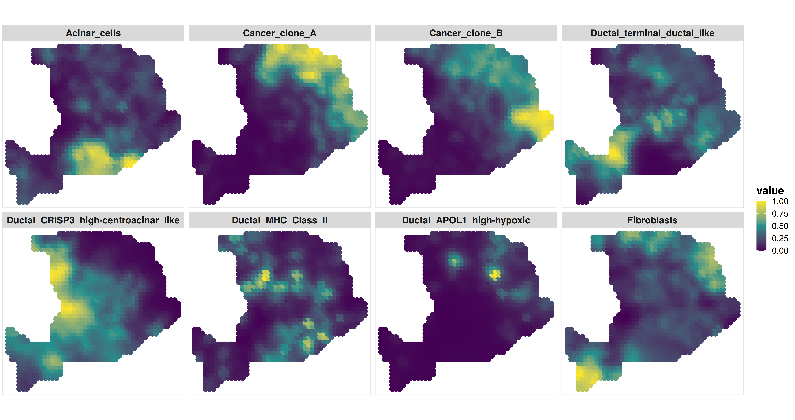
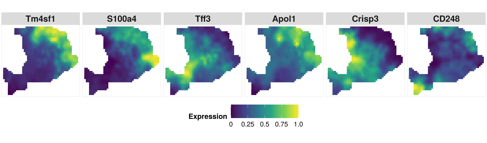
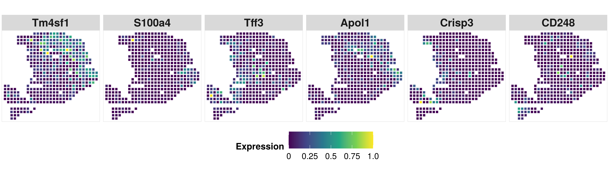
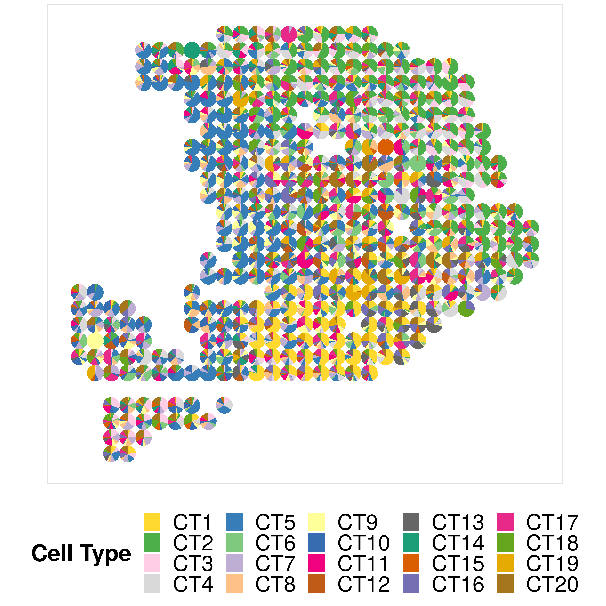
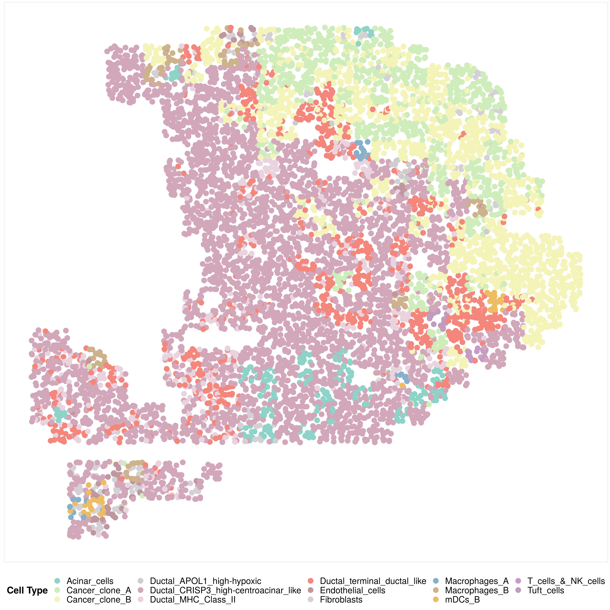

This tutorial is the example analysis with CARD on the human pancreatic ductal adenocarcinomas data from [Moncada et al, 2020](https://www.nature.com/articles/s41587-019-0392-8?proof=t). Before runing the tutorial, make sure that the CARD package is installed. Installation instructions see the [link](https://yma-lab.github.io/CARD/documentation/02_installation.html)

## Required input data
`CARD` requires two types of input data:
- spatial transcriptomics count data, along with spatial location information.  
- single cell RNAseq (scRNA-seq) count data, along with meta information indicating the cell type information and the sample (subject) information for each cell.  

The example data for runing the tutorial can be downloaded in this [page](https://yma-lab.github.io/CARD/documentation/03_data.html)
Here are the details about the required data input illustrated by the example datasets. 
### 1. spatial transcriptomics data, e.g.,
```r
#### load the example spatial transcriptomics count data, 
load("./spatial_count.RData")
spatial_count[1:4,1:4]
4 x 4 sparse Matrix of class "dgCMatrix"
           10x10 10x13 10x14 10x15
X5S_rRNA       .     .     .     .
X5_8S_rRNA     .     .     .     .
X7SK           .     .     .     .
A1BG.AS1       .     .     .     .
```
The spatial transcriptomics count data must be in the format of matrix or sparseMatrix, while each row represents a gene and each column represents a spatial location. The column names of the spatial data can be in the "XcoordxYcoord" (i.e., 10x10) format, but you can also maintain your original spot names, for example, barcode names. 
```r
#### load the example spatial location data, 
load("./spatial_location.RData")
spatial_location[1:4,]
       x  y
10x10 10 10
10x13 10 13
10x14 10 14
10x15 10 15
```
The spatial location data must be in the format of data frame while each row represents a spatial location, the first column represents the x coordinate and the second column represents the y coordinate. The rownames of the spatial location data frame should match exactly with the column names of the spatial_count.

### 2. single cell RNAseq ((scRNA-seq)) data,  e.g.,
```r
#### load the example scRNA-seq count data, 
load("./sc_count.RData")
sc_count[1:4,1:4]
4 x 4 sparse Matrix of class "dgCMatrix"
      Cell1 Cell2 Cell3 Cell4
A1BG      .     .     .     .
A1CF      .     .     .     1
A2M       .     .     .     .
A2ML1     .     .     .     .
```
The scRNA-seq count data must be in the format of matrix or sparseMatrix, while each row represents a gene and each column represents a cell.

```r
#### load the example scRNA-seq meta data, 
load("./sc_meta.RData")
sc_meta[1:4,]
      cellID                             cellType sampleInfo
Cell1  Cell1                         Acinar_cells    sample1
Cell2  Cell2          Ductal_terminal_ductal_like    sample1
Cell3  Cell3          Ductal_terminal_ductal_like    sample1
Cell4  Cell4 Ductal_CRISP3_high-centroacinar_like    sample1
```
The scRNAseq meta data must be in the format of data frame while each row represents a cell. The rownames of the scRNAseq meta data should match exactly with the column names of the scRNAseq count data. The sc_meta data must contain the column indicating the cell type assignment for each cell (e.g., "cellType" column in the example sc_meta data). Sample/subject information should be provided, if there is only one sample, we can add a column by ```sc_meta$sampleInfo = "sample1"```.

We suggest the users to check their single cell RNASeq data carefully before running CARD. We suggest the users to input the single cell RNAseq data with each cell type containing at least 2 cells. i.e. print(table(sc_meta$cellType,useNA = "ifany"))

## Cell Type Deconvolution
```r
library(CARD)
``` 
### 1. Create an `CARD` object
The CARD object is created by the function `createCARDObject`. The essential inputs are:
- sc_count: Matrix or sparse matrix of raw scRNA-seq count data, each row represents a gene and each column represents a cell. This sc_count data serves as a reference for the cell type deconvolution for spatial transcriptomics data. 
- sc_meta: Data frame, with each row representing the cell type and/or sample information of a specific cell. The row names of this data frame should match exactly with the column names of the sc_count data. The sc_meta data must contain the column indicating the cell type assignment for each cell (e.g., "cellType" column in the example sc_meta data). 
- spatial_count: Matrix or sparse matrix of raw spatial resolved transcriptomics count data, each row represents a gene and each column represents a spatial location. This is the spatial transcriptomics data that we are interested to deconvolute.
- spatial_location: Data frame, with two columns representing the x and y coordinates of the spatial location. The rownames of this data frame should match eaxctly with the columns of the spatial_count.
- ct.varname: Caracter, the name of the column in sc_meta that specifies the cell type assignment. 
- ct.select: Vector of cell type names that you are interested in to deconvolute, default as NULL. If NULL, then use all cell types provided by single cell dataset.
- sample.varname: Character,the name of the column in sc_meta that specifies the sample/subject information. If NULL, we just use the whole data as one sample/subject.
- minCountGene: Numeric, include spatial locations where at least this number of counts detected. Default is 100. 
- minCountSpot: Numeric, include genes where at least this number of spatial locations that have non-zero expression. Default is 5.

```r
CARD_obj = createCARDObject(
	sc_count = sc_count,
	sc_meta = sc_meta,
	spatial_count = spatial_count,
	spatial_location = spatial_location,
	ct.varname = "cellType",
	ct.select = unique(sc_meta$cellType),
	sample.varname = "sampleInfo",
	minCountGene = 100,
	minCountSpot = 5) 
## QC on scRNASeq dataset! ...
## QC on spatially-resolved dataset! ..
```
The spatial data are stored in `CARD_obj@spatial_countMat` and `CARD_obj@spatial_location` while the scRNA-seq data is stored in CARD_obj@sc_eset in the format of SingleCellExperiment. 

### 2. Deconvolution using CARD
Now we have evrything stored in the CARD object, we can use CARD to deconvolute the spatial transcriptomics data. CARD is computationally fast and memory efficient. CARD relies on an efficient optimization algorithm for constrained maximum likelihood estimation and is scalable to spatial transcriptomics with tens of thousands of spatial locations and tens of thousands of genes. For the example dataset with the sample size of 428 locations, it takes within a minute to finish the deconvolution. 

```r
CARD_obj = CARD_deconvolution(CARD_object = CARD_obj)
## create reference matrix from scRNASeq...
## Select Informative Genes! ...
## Deconvolution Starts! ...
## Deconvolution Finish! ...
```
The results are stored in `CARD_obj@Proportion_CARD`. 
```r
print(CARD_obj@Proportion_CARD[1:2,])
      Acinar_cells Ductal_terminal_ductal_like
10x10 6.370860e-02                  0.02391251
10x13 7.818278e-08                  0.02996182
      Ductal_CRISP3_high-centroacinar_like Cancer_clone_A Ductal_MHC_Class_II
10x10                            0.1801753   4.229928e-04         0.021557706
10x13                            0.9620440   1.910394e-07         0.006437371
      Cancer_clone_B      mDCs_A Ductal_APOL1_high-hypoxic   Tuft_cells
10x10   4.339480e-05 0.011136707              4.967235e-04 2.025089e-03
10x13   2.319262e-05 0.001013068              3.864917e-06 1.796433e-06
            mDCs_B         pDCs Endocrine_cells Endothelial_cells Macrophages_A
10x10 0.0792525811 7.432979e-07    6.848627e-03      1.722855e-01  9.909662e-02
10x13 0.0004695018 1.566377e-11    3.925412e-11      4.198468e-11  2.766705e-05
        Mast_cells Macrophages_B T_cells_&_NK_cells    Monocytes        RBCs
10x10 7.411147e-11  3.090675e-02       4.976256e-06 2.663846e-06 3.84187e-10
10x13 2.387132e-11  9.499908e-06       1.172387e-11 2.000116e-06 1.00967e-06
       Fibroblasts
10x10 3.081225e-01
10x13 4.898874e-06
```
### 3. Visualize the proportion for each cell type
First, we jointly visualize the cell type proportion matrix through scatterpie plot. Note that here because the number of spots is relatively small, so jointly visualize the cell type proportion matrix in the scatterpie plot format is duable. We do not recommend users to visualize this plot when the number of spots is > 500. Instead, we recommend users to visualize the proportion directly, i.e., using the function CARD.visualize.prop(). Details of using this function see the next example.  
```r
## set the colors. Here, I just use the colors in the manuscript, if the color is not provided, the function will use default color in the package. 
colors = c("#FFD92F","#4DAF4A","#FCCDE5","#D9D9D9","#377EB8","#7FC97F","#BEAED4",
    "#FDC086","#FFFF99","#386CB0","#F0027F","#BF5B17","#666666","#1B9E77","#D95F02",
    "#7570B3","#E7298A","#66A61E","#E6AB02","#A6761D")
p1 <- CARD.visualize.pie(
	proportion = CARD_obj@Proportion_CARD,
	spatial_location = CARD_obj@spatial_location, 
 	colors = colors, 
  	radius = 0.52) ### You can choose radius = NULL or your own radius number
print(p1)
```
Here is an example output: 


Then, we can select some interested cell types to visualize separately. 

```r
## select the cell type that we are interested
ct.visualize = c("Acinar_cells","Cancer_clone_A","Cancer_clone_B","Ductal_terminal_ductal_like","Ductal_CRISP3_high-centroacinar_like","Ductal_MHC_Class_II","Ductal_APOL1_high-hypoxic","Fibroblasts")
## visualize the spatial distribution of the cell type proportion
p2 <- CARD.visualize.prop(
	proportion = CARD_obj@Proportion_CARD,        
	spatial_location = CARD_obj@spatial_location, 
	ct.visualize = ct.visualize,                 ### selected cell types to visualize
	colors = c("lightblue","lightyellow","red"), ### if not provide, we will use the default colors
	NumCols = 4,                                 ### number of columns in the figure panel
        pointSize = 3.0)                             ### point size in ggplot2 scatterplot  
print(p2)

```
Here is an example output: 


### 4. Visualize the proportion for two cell types
Motivated by this github [issue post](https://github.com/YingMa0107/CARD/issues/25#issuecomment-1550231037), we added a new visualization function to visualize the distribution of two cell types on the same post.  

```
## visualize the spatial distribution of two cell types on the same plot
p3 = CARD.visualize.prop.2CT(
proportion = CARD_obj@Proportion_CARD,                             ### Cell type proportion estimated by CARD
spatial_location = CARD_obj@spatial_location,                      ### spatial location information
ct2.visualize = c("Cancer_clone_A","Cancer_clone_B"),              ### two cell types you want to visualize
colors = list(c("lightblue","lightyellow","red"),c("lightblue","lightyellow","black")))       ### two color scales                             
print(p3)

```
Here is an example output:
<p align="center"> 

</p>
### 5. Visualize the cell type proportion correlation 
```r
p4 <- CARD.visualize.Cor(CARD_obj@Proportion_CARD,colors = NULL) # if not provide, we will use the default colors
print(p4)
```
Here is an example output: 
<p align="left"> 

</p>

## Refined spatial map
A unique feature of CARD is its ability to model the spatial correlation in cell type composition across tissue locations, thus enabling spatially informed cell type deconvolution. Modeling spatial correlation allows us to not only accurately infer the cell type composition on each spatial location, but also impute cell type compositions and gene expression levels on unmeasured tissue locations, facilitating the construction of a refined spatial tissue map with a resolution much higher than that measured in the original study.
Specifically, CARD constructed a refined spatial map through the function `CARD.imputation`. The essential inputs are:

- CARD_object: CARD Object with estimated cell type compositions on the original spatial resolved transcriptomics data.
- NumGrids: Initial number of newly grided spatial locations. The final number of newly grided spatial locations will be lower than this value since the newly grided locations outside the shape of the tissue will be filtered. 
- ineibor: Numeric, number of neighbors used in the imputation on newly grided spatial locations, default is 10.  

Briefly, CARD first outlined the shape of the tissue by applying a two-dimensional concave hull algorithm on the existing locations, then perform imputation on the newly grided spatial locations. We recommend to check the exisiting spatial locations to see if there are outliers that are seriously affect the detection of the shape. 

### 1. Imputation on the newly grided spatial locations
```r
CARD_obj = CARD.imputation(CARD_obj,NumGrids = 2000,ineibor = 10,exclude = NULL)
## The rownames of locations are matched ...
## Make grids on new spatial locations ...
```
The results are store in `CARD_obj@refined_prop` and `CARD_obj@refined_expression`

```r
## Visualize the newly grided spatial locations to see if the shape is correctly detected. If not, the user can provide the row names of the excluded spatial location data into the CARD.imputation function
location_imputation = cbind.data.frame(x=as.numeric(sapply(strsplit(rownames(CARD_obj@refined_prop),split="x"),"[",1)),
	y=as.numeric(sapply(strsplit(rownames(CARD_obj@refined_prop),split="x"),"[",2)))
rownames(location_imputation) = rownames(CARD_obj@refined_prop)
library(ggplot2)
p5 <- ggplot(location_imputation, 
       aes(x = x, y = y)) + geom_point(shape=22,color = "#7dc7f5")+
theme(plot.margin = margin(0.1, 0.1, 0.1, 0.1, "cm"),
    legend.position="bottom",
    panel.background = element_blank(),
    plot.background = element_blank(),
    panel.border = element_rect(colour = "grey89", fill=NA, size=0.5))
print(p5)
```
Here is the example of the newly grided spatial locations. The shape outline is detected well. 
<p align="center"> 

</p>

### 2. Visualize the cell type proportion at an enhanced resolution
Now we can use the same `CARD.visualize.prop` function to visualize the cell type proportion at the enhanced resolution. But this time, the input of the function should be the imputed cell typr propotion and corresponding newly grided spatial locations.
```r                                   
p6 <- CARD.visualize.prop(
	proportion = CARD_obj@refined_prop,                         
	spatial_location = location_imputation,            
	ct.visualize = ct.visualize,                    
	colors = c("lightblue","lightyellow","red"),    
	NumCols = 4)                                  
print(p6)
```


### 3. Visualize the marker gene expression at an enhanced resolution
After we obtained cell type proportion at the enhanced resolution by CARD, we can predict the spatial gene expression at the enhanced resolution. The following code is to visualize the marker gene expression at an enhanced resolution.
```r                                   
p7 <- CARD.visualize.gene(
	spatial_expression = CARD_obj@refined_expression,
	spatial_location = location_imputation,
	gene.visualize = c("Tm4sf1","S100a4","Tff3","Apol1","Crisp3","CD248"),
	colors = NULL,
	NumCols = 6)
print(p7)
```


Now, compare with the original resolution, CARD facilitates the construction of a refined spatial tissue map with a resolution much higher than that measured in the original study.
```r                                   
p8 <- CARD.visualize.gene(
	spatial_expression = CARD_obj@spatial_countMat,
	spatial_location = CARD_obj@spatial_location,
	gene.visualize = c("Tm4sf1","S100a4","Tff3","Apol1","Crisp3","CD248"),
	colors = NULL,
	NumCols = 6)
print(p8)
```


## Extension of CARD in a reference-free version: CARDfree
We extended CARD to enable reference-free cell type deconvolution and eliminate the need for the single-cell reference data. We refer to this extension as the reference-free version of CARD, or simply as CARDfree. Different from CARD, CARDfree no longer requires an external single-cell reference dataset and only needs users to input a list of gene names for previously known cell type markers. We use the same exmple dataset to illustrate the use of CARDfree. In addition to the exmple dataset, CARDfree also requires the input of marker gene list, which is in a list format with each element of the list being the cell type specific gene markers. The example marker list for runing the tutorial can be downloaded in this [page](https://yma-lab.github.io/CARD/documentation/03_data.html). 

Similar to CARD, we will first need to create a CARDfree object with the spatial transcriptomics dataset and the marker gene list 

### 1. Create an `CARDfree` object
The CARDfree object is created by the function `createCARDfreeObject`. Briefly, the essential inputs are the same as the function `createCARDObject`, except that this function does not require the single cell count and meta information matrix. Instead, it requires a markerList. 

```r
## load the marker gene list
load("./markerList.RData")
CARDfree_obj = createCARDfreeObject(
	markerList = markerList,
	spatial_count = spatial_count,
	spatial_location = spatial_location,
	minCountGene = 100,
	minCountSpot =5) 
```
The spatial data are stored in `CARDfree_obj@spatial_countMat` and `CARDfree_obj@spatial_location` while the marker list is stored in CARDfree_objj@markerList in the format of list. 
### 2. Deconvolution using CARDfree
```r
## deconvolution using CARDfree
CARDfree_obj = CARD_refFree(CARDfree_obj)
```
The results are stored in `CARDfree_obj@Proportion_CARD`. 
```r
## One limitation of reference-free version of CARD is that the cell types inferred from CARDfree do not come with a cell type label. It might be difficult to interpret the results. 
print(CARDfree_obj@Proportion_CARD[1:2,])
            CT1          CT2          CT3          CT4          CT5
10x10 0.1293363 8.155678e-12 1.342871e-10 7.934516e-06 1.029232e-01
10x13 0.7580073 1.241726e-23 1.981989e-27 3.367648e-40 1.577430e-37
               CT6          CT7          CT8          CT9         CT10
10x10 6.081635e-02 3.932038e-04 4.996482e-07 1.862520e-08 4.092203e-12
10x13 2.162971e-27 1.934013e-25 3.096247e-87 1.903368e-08 2.520620e-02
            CT11       CT12       CT13        CT14         CT15         CT16
10x10 0.05317422 0.22235226 0.05971717 0.174335930 5.853567e-38 2.537400e-10
10x13 0.02868479 0.08371092 0.09967332 0.004615396 4.214875e-37 1.017432e-04
              CT17         CT18         CT19         CT20
10x10 8.433169e-11 1.219174e-01 1.077052e-16 7.502541e-02
10x13 3.462751e-07 7.941545e-64 9.548596e-20 3.760342e-13
```

### 3. Visualization of the results of CARDfree
Note that here because the number of spots is relatively small, so jointly visualize the cell type proportion matrix in the scatterpie plot format is duable. We do not recommend users to visualize this plot when the number of spots is > 500. Instead, we recommend users to visualize the proportion directly, i.e., using the function CARD.visualize.prop(). 
```r
colors = c("#FFD92F","#4DAF4A","#FCCDE5","#D9D9D9","#377EB8","#7FC97F","#BEAED4","#FDC086","#FFFF99","#386CB0","#F0027F","#BF5B17","#666666","#1B9E77","#D95F02","#7570B3","#E7298A","#66A61E","#E6AB02","#A6761D")
### In order to maximumply match with the original results of CARD, we order the colors to generally match with the results infered by CARD
CARDfree_obj@Proportion_CARD = CARDfree_obj@Proportion_CARD[,c(8,10,14,2,1,6,12,18,7,13,20,19,16,17,11,15,4,9,3,5)]
colnames(CARDfree_obj@Proportion_CARD) = paste0("CT",1:20)
p9 <- CARD.visualize.pie(CARDfree_obj@Proportion_CARD,CARDfree_obj@spatial_location,colors = colors)
print(p9)
```

## Extension of CARD for single cell resolution mapping
We also extended CARD to facilitate the construction of single-cell resolution spatial transcriptomics from non-single-cell resolution spatial transcriptomics. Details of the algorithm see the main text. Briefly, we infer the single cell resolution gene expression for each measured spatial location from the non-single cell resolution spatial transcriptomics data based on reference scRNaseq data we used for deconvolution. The procedure is implemented in the function `CARD_SCMapping`. The essential inputs are:
- CARD_object: CARD object create by the createCARDObject function. This one should be the one after we finish the deconvolution procedure
- shapeSpot: a character indicating whether the sampled spatial coordinates for single cells locating in a Square-like region or a Circle-like region. The center of this region is the measured spatial location in the non-single cell resolution spatial transcriptomics data. The default is "Square", and the other option is "Circle"
- numCell: a numeric value indicating the number of cores used to accelerate the procedure.
```r
#### Note that here the shapeSpot is the user defined variable which indicates the capturing area of single cells. Details see above.
scMapping = CARD_SCMapping(CARD_obj,shapeSpot="Square",numCell=20,ncore=10)
print(scMapping)
### the output
class: SingleCellExperiment 
dim: 16381 8560 
metadata(0):
assays(1): counts
rownames(16381): A1BG A1CF ... ZZEF1 ZZZ3
rowData names(1): rownames(count_CT)
colnames(8560): Cell686:10x10:9.97518192091957x9.83765210071579
  Cell734:10x10:10.1896061601583x9.94081321195699 ...
  Cell443:9x33:9.4747460691724x32.5644472888671
  Cell1488:9x33:9.43348842463456x33.4998327996582
colData names(7): x y ... CT Cell
reducedDimNames(0):
mainExpName: NULL
altExpNames(0):
### spatial location info and expression count of the single cell resolution data
library(SingleCellExperiment)
MapCellCords = as.data.frame(colData(scMapping))
count_SC = assays(scMapping)$counts
```
The results are stored in a SingleCellExperiment object with mapped single cell resolution counts stored in the assays slot and the information of the spatial location for each single cell as well as their relashionship to the original measured spatial location is stored in the colData slot. 

Next, we visualize the cell type for each single cell with their spatial location information 
```r
library(ggplot2)
df = MapCellCords
colors = c("#8DD3C7","#CFECBB","#F4F4B9","#CFCCCF","#D1A7B9","#E9D3DE","#F4867C","#C0979F",
	"#D5CFD6","#86B1CD","#CEB28B","#EDBC63","#C59CC5","#C09CBF","#C2D567","#C9DAC3","#E1EBA0",
	"#FFED6F","#CDD796","#F8CDDE")
p10 = ggplot(df, aes(x = x, y = y, colour = CT)) + 
    geom_point(size = 3.0) +
    scale_colour_manual(values =  colors) +
    #facet_wrap(~Method,ncol = 2,nrow = 3) + 
        theme(plot.margin = margin(0.1, 0.1, 0.1, 0.1, "cm"),
              panel.background = element_rect(colour = "white", fill="white"),
              plot.background = element_rect(colour = "white", fill="white"),
    legend.position="bottom",
    panel.border = element_rect(colour = "grey89", fill=NA, size=0.5),
    axis.text =element_blank(),
    axis.ticks =element_blank(),
    axis.title =element_blank(),
    legend.title=element_text(size = 13,face="bold"),
    legend.text=element_text(size = 12),
    legend.key = element_rect(colour = "transparent", fill = "white"),
    legend.key.size = unit(0.45, 'cm'),
    strip.text = element_text(size = 15,face="bold"))+
                                guides(color=guide_legend(title="Cell Type"))
print(p10)
```

